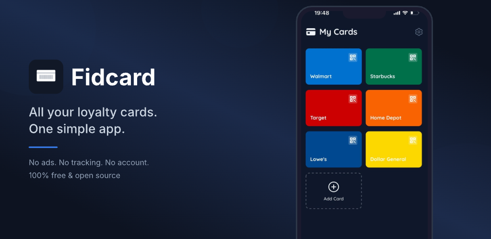

# Fidcard

Simple loyalty card wallet. All your loyalty cards in one app. No account, no ads, no tracking, open source. Just scan and go.



<p align="left">
  <a href="https://apps.apple.com/fr/app/fidcard-cartes-de-fid%C3%A9lit%C3%A9/id6761309130"></a>
  &nbsp;
  <a href="https://play.google.com/store/apps/details?id=com.devanco.basic.fidcard"></a>
</p>

## About

Fidcard is a straightforward loyalty card app that does one thing and does it well: store all your loyalty cards in one place.

Scan your physical loyalty cards using your camera or enter the number manually. When you need to use a card at checkout, just open Fidcard and show the barcode or QR code on your screen — the brightness is automatically maximized for easy scanning.

**Why Fidcard?**

- **Dead simple.** No account needed. No sign-up. No email. Just open the app and start adding your cards.
- **No ads. No tracking.** Your data stays on your device. Period. We don't collect anything.
- **Open source.** The code is fully transparent and publicly available. You can verify exactly what the app does.

## Features

- Scan barcodes and QR codes with your camera
- Supports all major barcode formats (Code128, EAN-13, EAN-8, QR, PDF417, Aztec, and more)
- Customize each card with a name and color for easy identification
- Reorder your cards with drag and drop
- Manual entry if scanning doesn't work
- Light, dark, and system theme support
- Available in English and French

## Tech Stack

- [Expo](https://expo.dev/) / React Native
- TypeScript
- [Expo Router](https://docs.expo.dev/router/introduction/) (file-based routing)
- [NativeWind](https://www.nativewind.dev/) (Tailwind CSS)
- [Zustand](https://github.com/pmndrs/zustand) (state management)

## Getting Started

### Prerequisites

- Node.js
- [pnpm](https://pnpm.io/)

### Install

```bash
pnpm install
```

### Run

```bash
npx expo start
```

Then open the app on (as you prefer):

- [Expo Go](https://expo.dev/go)
- [Development build](https://docs.expo.dev/develop/development-builds/introduction/)
- [Android emulator](https://docs.expo.dev/workflow/android-studio-emulator/)
- [iOS simulator](https://docs.expo.dev/workflow/ios-simulator/)

## Project Structure

```
app/          Routes and layouts (Expo Router)
components/   Reusable UI components
store/        Zustand stores
lib/          Utilities
assets/       Images and fonts
```

## License

[MIT](LICENSE)
